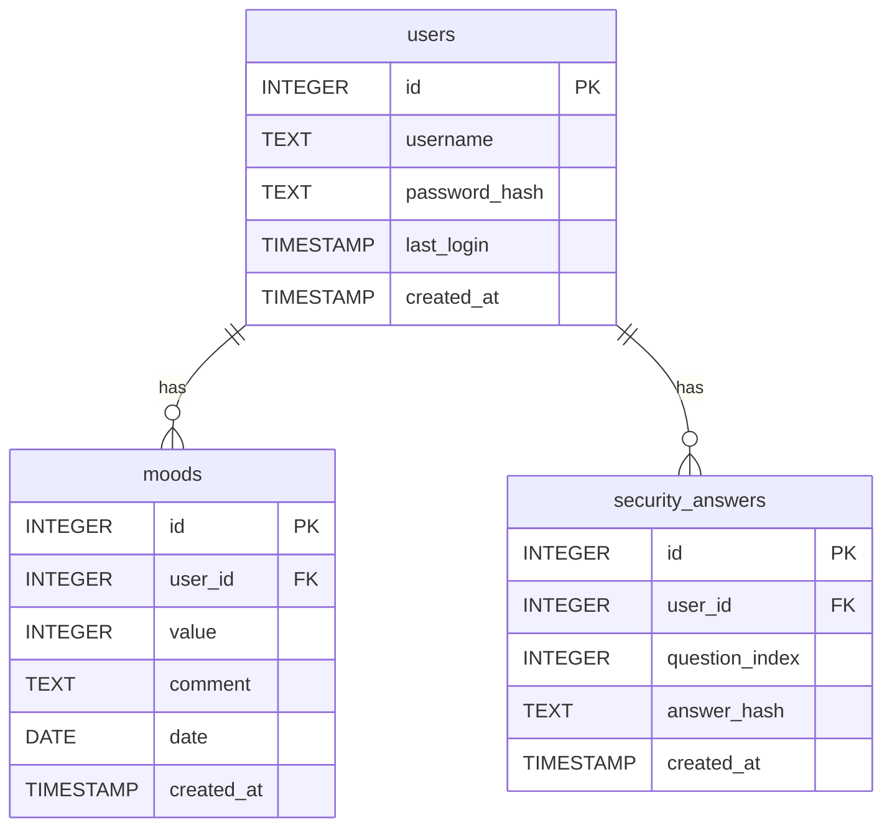

# Smoodo

Smoodo is a mood-tracking app made with SvelteKit and SQLite.

<https://smoodo.netlify.app>

## Database diagram

```mermaid
erDiagram
    users {
        INTEGER id PK
        TEXT username
        TEXT password_hash
        TIMESTAMP last_login
        TIMESTAMP created_at
    }
    moods {
        INTEGER id PK
        INTEGER user_id FK
        INTEGER value
        TEXT comment
        DATE date
        TIMESTAMP created_at
    }
    security_answers {
        INTEGER id PK
        INTEGER user_id FK
        INTEGER question_index
        TEXT answer_hash
        TIMESTAMP created_at
    }

    users ||--o{ moods : "has"
    users ||--o{ security_answers : "has"
```
